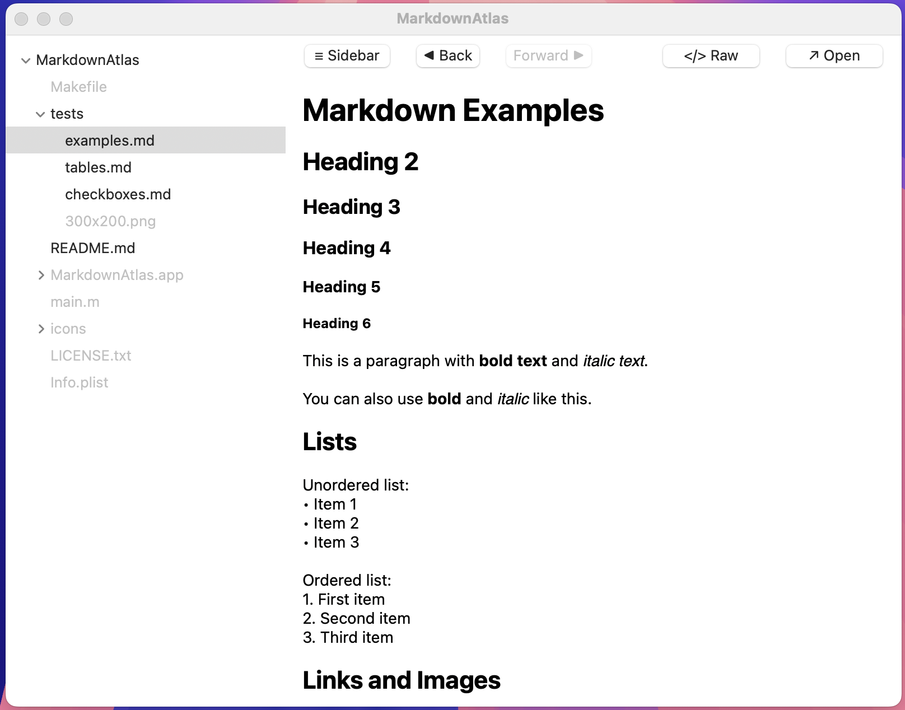

# MarkdownAtlas

A lightweight macOS markdown viewer built with native Cocoa. Zero dependencies, less than 1000 lines of code.


## Why MarkdownAtlas?

### Privacy & Security
- **No telemetry or tracking** - your files stay private
- **No internet connection required** - works completely offline
- **No data collection** - doesn't phone home or send analytics
- **Auditable codebase** - small enough to review yourself (under 1000 lines)

### Simplicity & Trust
- **Zero dependencies** - no hidden third-party code or supply chain risks
- **Native macOS app** - uses only Apple's built-in frameworks
- **Single file architecture** - easy to understand and verify
- **Open source** - see exactly what the code does

### Practical Benefits
- **Fast & lightweight** - instant startup, minimal memory usage
- **No bloat** - just markdown viewing, nothing else
- **Works everywhere** - no installation of external tools needed
- **Future-proof** - simple code that will run for years

### Compared to Alternatives
- **vs Electron apps** (Typora, MarkText): 100x smaller, no Chromium bloat, better battery life
- **vs Web-based tools**: Works offline, no account needed, truly private
- **vs Heavy IDEs** (VS Code): Purpose-built for viewing, not editing - faster and simpler
- **vs TextEdit**: Rich markdown rendering with tables, code blocks, and images

Perfect for reading documentation, reviewing markdown files, or quick previews without the overhead of heavy applications.

## Features

### Navigation & UI
- **File browser sidebar** with folder tree navigation
- **Toggle sidebar** with smooth animation
- **Back/Forward navigation** with history tracking
- **Scroll position memory** - remembers where you were when navigating back
- **Filter directories** - only shows folders containing markdown files

### Viewing Modes
- **Preview mode** - rendered markdown with formatting
- **Raw mode** - view source markdown text
- **Open in external app** - quick access to open file in default editor

### Markdown Rendering
- Live rendering with rich text formatting
- Tables with bordered cells and proper alignment
- Code blocks with syntax-aware background
- Inline code with monospace font
- Clickable links (web URLs and file paths)
- Embedded images with fallback for missing files
- Task lists with checkboxes

### Technical
- Zero dependencies - pure Cocoa/Objective-C
- Single file architecture (under 1000 lines)
- Native macOS look and feel
- Fast startup and rendering

## Build

```bash
make
```

## Run

```bash
make run
```

With a specific folder:

```bash
./build/MarkdownAtlas.app/Contents/MacOS/MarkdownAtlas ./path/to/folder
```

Or use `open`:

```bash
open -a build/MarkdownAtlas.app /path/to/docs
```

## Install (Optional)

Create a symlink for global access:

```bash
mkdir -p ~/.local/bin
ln -s $(pwd)/build/MarkdownAtlas.app/Contents/MacOS/MarkdownAtlas ~/.local/bin/mda
```

Make sure `~/.local/bin` is in your PATH:

```bash
export PATH="$HOME/.local/bin:$PATH"
```

Then use it from anywhere:

```bash
mda ./docs
mda ~/projects/markdown-files
```

## Requirements

- macOS
- gcc with Cocoa framework
- C2x standard support

## Technical

- **Language**: Objective-C
- **Framework**: Native Cocoa (AppKit)
- **Dependencies**: None - zero external libraries
- **Build**: Simple Makefile with gcc
- **Coded with**: Claude Code

## Supported Markdown

- Headings `(# through ######)`
- Bold `(**text** or __text__)`
- Italic `(*text* or _text_)`
- Inline code `(`code`)`
- Code blocks `(```)`
- Blockquotes `(>)`
- Lists `(- or *)`
- Checkboxes `(- [ ] or - [x])`
- Tables `(| Header | Header |)`
- Horizontal rules `(---)`
- Links `([text](url))`
- Images `()`

See full example at [tests/examples.md](tests/examples.md)

## License

JSON License - see [LICENSE.txt](LICENSE.txt)
